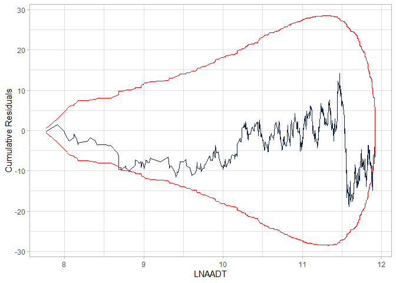
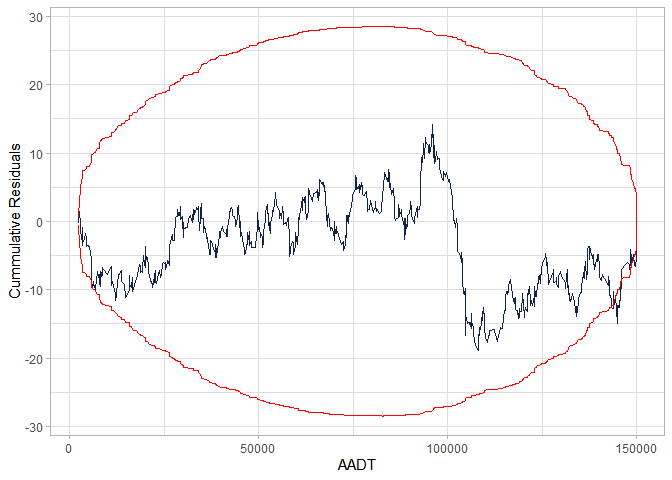
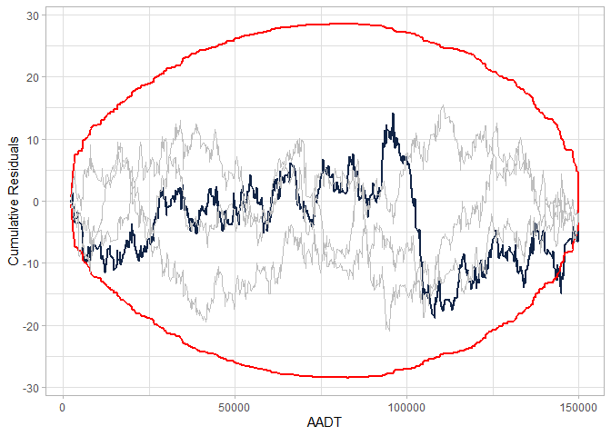

<!-- README.md is generated from README.Rmd. Please edit that file -->

# cureplots

<!-- badges: start -->

[](https://app.codecov.io/gh/gbasulto/cureplots?branch=master)

<!-- badges: end -->

Cumulative residual (CURE) plots assess the goodness-of-fit of a
covariate in a generalized linear regression model, usually a negative
binomial regression or a Poisson regression. The package `cureplots`
produces CURE plots for the requested variables produced with
[`ggplot2`](https://ggplot2.tidyverse.org/) or a table to easily produce
a customized plot with the desired package.

## Installation

You can install the development version of `cureplots` from
[GitHub](https://github.com/) with the following:

``` r
# install.packages("devtools")
devtools::install_github("gbasulto/cureplots")
```

## Example

The example below shows

- How to produce a cure plot directly from the model object and
- How to produce the table to customize a plot.

A Poisson GLM model is adjusted to simulated data using the package
`glm`. The functions also work with the `gam` package.

``` r
library(cureplots)

## basic example

set.seed(2000)

## Define parameters
beta <- c(-1, 0.3, 3)

## Simulate idependent variables
n <- 900
AADT <- c(runif(n, min = 2000, max = 150000))
nlanes <- sample(x = c(2, 3, 4), size = n, replace = TRUE)
LNAADT <- log(AADT)

## Simulate dependent variable
theta <- exp(beta[1] + beta[2] * LNAADT + beta[3] * nlanes)
y <- rpois(n, theta)

## Fit model
mod <- glm(y ~ LNAADT + nlanes, family = poisson)

## Calculate residuals
res <- residuals(mod, type = "working")

## Calculate CURE plot data
cure_df <- calculate_cure_dataframe(AADT, res)
#> Covariate: AADT

head(cure_df)
#> # A tibble: 6 × 5
#>    AADT  residual    cumres     lower    upper
#>   <dbl>     <dbl>     <dbl>     <dbl>    <dbl>
#> 1 2363. -0.000379 -0.000379 -0.000743 0.000743
#> 2 2435.  0.0112    0.0108   -0.0219   0.0219  
#> 3 2724.  0.00769   0.0185   -0.0266   0.0266  
#> 4 2978. -0.00233   0.0162   -0.0270   0.0270  
#> 5 3007. -0.0119    0.00424  -0.0356   0.0356  
#> 6 3149. -0.0101   -0.00589  -0.0407   0.0407

## Providing CURE data frame
cure_plot(cure_df)
#> CURE data frame was provided. Its first column, AADT, will be used.
```



``` r

## Providing glm object
cure_plot(mod, "LNAADT")
#> Covariate LNAADT will be used to produce CURE plot.
```



## Example with Resampling

``` r
library(cureplots)

## basic example

set.seed(2000)

## Define parameters.
beta <- c(-1, 0.3, 3)

## Simulate idependent variables
n <- 900
AADT <- c(runif(n, min = 2000, max = 150000))
nlanes <- sample(x = c(2, 3, 4), size = n, replace = TRUE)
LNAADT <- log(AADT)

## Simulate dependent variable
theta <- exp(beta[1] + beta[2] * LNAADT + beta[3] * nlanes)
y <- rpois(n, theta)

## Fit model
mod <- glm(y ~ LNAADT + nlanes, family = poisson)

## Calculate residuals
res <- residuals(mod, type = "working")

## Calculate CURE plot data
cure_df <- calculate_cure_dataframe(AADT, res)
#> Covariate: AADT

n_resamples <- 3

library(tidyverse)
#> ── Attaching core tidyverse packages ──────────────────────── tidyverse 2.0.0 ──
#> ✔ dplyr     1.1.3     ✔ readr     2.1.4
#> ✔ forcats   1.0.0     ✔ stringr   1.5.0
#> ✔ ggplot2   3.4.3     ✔ tibble    3.2.1
#> ✔ lubridate 1.9.2     ✔ tidyr     1.3.0
#> ✔ purrr     1.0.2
#> ── Conflicts ────────────────────────────────────────── tidyverse_conflicts() ──
#> ✖ dplyr::filter() masks stats::filter()
#> ✖ dplyr::lag()    masks stats::lag()
#> ℹ Use the conflicted package (<http://conflicted.r-lib.org/>) to force all conflicts to become errors

if (n_resamples > 0) {
  resamples_tbl <- 
    1:n_resamples |> 
    map_df(\(x) 
           calculate_cure_dataframe(AADT, sample(res)) |> 
             transmute(resample = x, AADT, cumres) 
    )
}
#> Covariate: AADT
#> 
#> Covariate: AADT
#> 
#> Covariate: AADT


cure_plot(cure_df) + 
  geom_line(data = resamples_tbl, aes(x= AADT, y = cumres, group = resample), color = "grey")
#> CURE data frame was provided. Its first column, AADT, will be used.
```



``` r


head(cure_df)
#> # A tibble: 6 × 5
#>    AADT  residual    cumres     lower    upper
#>   <dbl>     <dbl>     <dbl>     <dbl>    <dbl>
#> 1 2363. -0.000379 -0.000379 -0.000743 0.000743
#> 2 2435.  0.0112    0.0108   -0.0219   0.0219  
#> 3 2724.  0.00769   0.0185   -0.0266   0.0266  
#> 4 2978. -0.00233   0.0162   -0.0270   0.0270  
#> 5 3007. -0.0119    0.00424  -0.0356   0.0356  
#> 6 3149. -0.0101   -0.00589  -0.0407   0.0407

## Providing CURE data frame
cure_plot(cure_df)
#> CURE data frame was provided. Its first column, AADT, will be used.
```


<!-- 
To do list 
1. dd 
2. ccc 
-->
