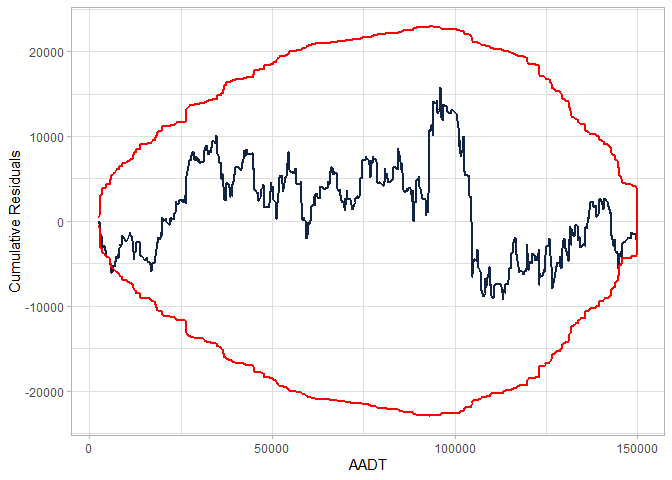

<!-- README.md is generated from README.Rmd. Please edit that file -->

# cureplots

<!-- badges: start -->
<!-- badges: end -->

The goal of cureplots is to …

## Installation

You can install the development version of cureplots from
[GitHub](https://github.com/) with:

``` r
# install.packages("devtools")
devtools::install_github("gbasulto/cureplots")
```

## Example

This is a basic example which shows you how to solve a common problem:

``` r
library(cureplots)
library(ggplot2)
## basic example code

set.seed(2000)

## Define parameters
beta <- c(-1, 0.3, 3)

## Simulate idependent variables
n <- 900
AADT <- c(runif(n, min = 2000, max = 150000))
nlanes <- sample(x = c(2, 3, 4), size = n, replace = TRUE)
LNAADT <- log(AADT)

## Simulate dependent variable
theta <- exp(beta[1] + beta[2] * LNAADT + beta[3] * nlanes)
y <- rpois(n, theta)

## Fit model
mod <- glm(y ~ LNAADT + nlanes, family = poisson)

## Calculate residuals
res <- residuals(mod)

## Calculate CURE plot data
cure_df <- calculate_cure_dataframe(AADT, res)
#> Covariate =  AADT

head(cure_df)
#> # A tibble: 6 × 5
#>    AADT residual cummres  lower upper
#>   <dbl>    <dbl>   <dbl>  <dbl> <dbl>
#> 1 2363.   -0.297  -0.297 -0.583 0.583
#> 2 2435.    0.438   0.140 -1.04  1.04 
#> 3 2724.    1.37    1.51  -2.88  2.88 
#> 4 2978.   -1.89   -0.380 -4.69  4.69 
#> 5 3007.   -0.484  -0.864 -4.78  4.78 
#> 6 3149.   -1.85   -2.72  -5.99  5.99

calculate_cure_dataframe(LNAADT, res) |>
  ggplot() +
  geom_line(aes(x = LNAADT, y = cummres), size = 0.5, colour = "#112446") +
  geom_line(aes(x = LNAADT, y = upper), size = 0.5, colour = "red") +
  geom_line(aes(x = LNAADT, y = lower), size = 0.5, colour = "red") +
  labs(x = "LNAADT", y = "Cummulative Residuals") +
  theme_light()
#> Covariate =  LNAADT
```



``` r


calculate_cure_dataframe(AADT, res) |>
  ggplot() +
  geom_line(aes(x = AADT, y = cummres), size = 0.5, colour = "#112446") +
  geom_line(aes(x = AADT, y = upper), size = 0.5, colour = "red") +
  geom_line(aes(x = AADT, y = lower), size = 0.5, colour = "red") +
  labs(x = "AADT", y = "Cummulative Residuals") +
  theme_light()
#> Covariate =  AADT
```


What is special about using `README.Rmd` instead of just `README.md`?
You can include R chunks like so:

``` r
summary(cars)
#>      speed           dist       
#>  Min.   : 4.0   Min.   :  2.00  
#>  1st Qu.:12.0   1st Qu.: 26.00  
#>  Median :15.0   Median : 36.00  
#>  Mean   :15.4   Mean   : 42.98  
#>  3rd Qu.:19.0   3rd Qu.: 56.00  
#>  Max.   :25.0   Max.   :120.00
```

You’ll still need to render `README.Rmd` regularly, to keep `README.md`
up-to-date. `devtools::build_readme()` is handy for this. You could also
use GitHub Actions to re-render `README.Rmd` every time you push. An
example workflow can be found here:
<https://github.com/r-lib/actions/tree/v1/examples>.

You can also embed plots, for example:


In that case, don’t forget to commit and push the resulting figure
files, so they display on GitHub and CRAN.
