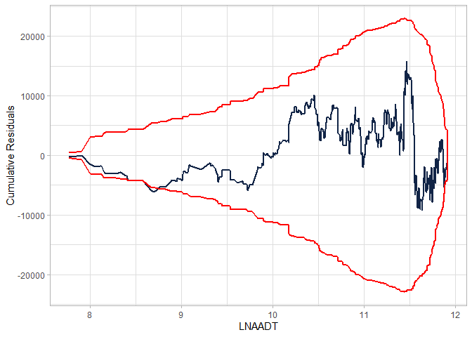
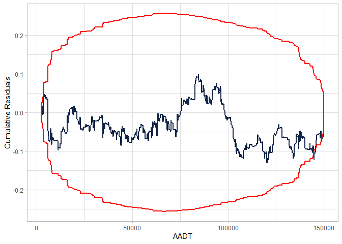

<!-- README.md is generated from README.Rmd. Please edit that file -->

# cureplots

<!-- badges: start -->
<!-- badges: end -->

Cumulative residual (CURE) plots assesses the goodness-of-fit of a
covariate in a generalized linear regression model, usually a negative
binomial regression or a Poisson regression. The package `cureplots`
produces CURE plots for the requested variables produced with
[`ggplot2`](https://ggplot2.tidyverse.org/), or a table to easily
produce a customized plot with the desired package.

## Installation

You can install the development version of cureplots from
[GitHub](https://github.com/) with:

``` r
# install.packages("devtools")
devtools::install_github("gbasulto/cureplots")
```

## Example

The example below shows

- How to produce a cureplot directly from the model object, and
- How to produce the table to customize a plot.

A Poisson GLM model is adjusted to simulated data using the package
`glm`. The functions also work with `gam` package.

``` r
library(cureplots)

## basic example

set.seed(2000)

## Define parameters
beta <- c(-1, 0.3, 3)

## Simulate idependent variables
n <- 900
AADT <- c(runif(n, min = 2000, max = 150000))
nlanes <- sample(x = c(2, 3, 4), size = n, replace = TRUE)
LNAADT <- log(AADT)

## Simulate dependent variable
theta <- exp(beta[1] + beta[2] * LNAADT + beta[3] * nlanes)
y <- rpois(n, theta)

## Fit model
mod <- glm(y ~ LNAADT + nlanes, family = poisson)

## Calculate residuals
res <- residuals(mod)

## Calculate CURE plot data
cure_df <- calculate_cure_dataframe(AADT, res)
#> Covariate: AADT

head(cure_df)
#> # A tibble: 6 × 5
#>    AADT residual cumres  lower upper
#>   <dbl>    <dbl>  <dbl>  <dbl> <dbl>
#> 1 2363.   -0.297 -0.297 -0.583 0.583
#> 2 2435.    0.438  0.140 -1.04  1.04 
#> 3 2724.    1.37   1.51  -2.88  2.88 
#> 4 2978.   -1.89  -0.380 -4.69  4.69 
#> 5 3007.   -0.484 -0.864 -4.78  4.78 
#> 6 3149.   -1.85  -2.72  -5.99  5.99

## Providing CURE data frame
cure_plot(cure_df)
#> CURE data frame was provided. Its first column, AADT, will be used.
```


``` r

## Providing glm object
cure_plot(mod, "LNAADT")
#> Covariate LNAADT will be used to produce CURE plot.
```



## Example with Resampling

``` r
library(cureplots)

## basic example

set.seed(2000)

## Define parameters
beta <- c(-1, 0.3, 3)

## Simulate idependent variables
n <- 900
AADT <- c(runif(n, min = 2000, max = 150000))
nlanes <- sample(x = c(2, 3, 4), size = n, replace = TRUE)
LNAADT <- log(AADT)

## Simulate dependent variable
theta <- exp(beta[1] + beta[2] * LNAADT + beta[3] * nlanes)
y <- rpois(n, theta)

## Fit model
mod <- glm(y ~ LNAADT + nlanes, family = poisson)

## Calculate residuals
res <- residuals(mod)

## Calculate CURE plot data
cure_df <- calculate_cure_dataframe(AADT, res)
#> Covariate: AADT

n_resamples <- 3

library(tidyverse)
#> ── Attaching packages ─────────────────────────────────────── tidyverse 1.3.2
#> ──
#> ✔ ggplot2 3.4.0      ✔ purrr   1.0.1 
#> ✔ tibble  3.1.8      ✔ dplyr   1.0.10
#> ✔ tidyr   1.3.0      ✔ stringr 1.5.0 
#> ✔ readr   2.1.3      ✔ forcats 0.5.2 
#> ── Conflicts ────────────────────────────────────────── tidyverse_conflicts() ──
#> ✖ dplyr::filter() masks stats::filter()
#> ✖ dplyr::lag()    masks stats::lag()

if (n_resamples > 0) {
  resamples_tbl <- 
    1:n_resamples |> 
    map_df(\(x) 
           calculate_cure_dataframe(AADT, sample(res)) |> 
             transmute(resample = x, AADT, cumres) 
    )
}
#> Covariate: AADT
#> 
#> Covariate: AADT
#> 
#> Covariate: AADT


cure_plot(cure_df) + 
  geom_line(data = resamples_tbl, aes(x= AADT, y = cumres, group = resample), color = "grey")
#> CURE data frame was provided. Its first column, AADT, will be used.
```


``` r


head(cure_df)
#> # A tibble: 6 × 5
#>    AADT residual cumres  lower upper
#>   <dbl>    <dbl>  <dbl>  <dbl> <dbl>
#> 1 2363.   -0.297 -0.297 -0.583 0.583
#> 2 2435.    0.438  0.140 -1.04  1.04 
#> 3 2724.    1.37   1.51  -2.88  2.88 
#> 4 2978.   -1.89  -0.380 -4.69  4.69 
#> 5 3007.   -0.484 -0.864 -4.78  4.78 
#> 6 3149.   -1.85  -2.72  -5.99  5.99

## Providing CURE data frame
cure_plot(cure_df)
#> CURE data frame was provided. Its first column, AADT, will be used.
```



<!-- 
To do list 
1. dd 
2. ccc 
-->
